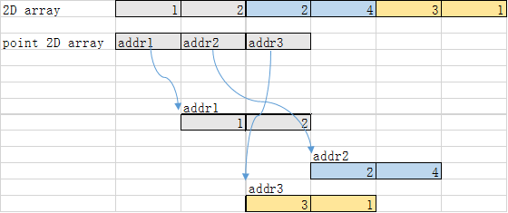

下面从数组作为参数着手，通过详细的例子描述了qsort针对数组进行排序的用法。

# 数组作为参数

原则：数组作为函数的参数的时候，是将数组作为指针传入函数，即在函数里面，接收数组的变量就是指向第一个元素的指针。

## 一维数组

```c
void array_1(int *a, int size)
{
    // a指向数组的第一个元素
    printf("addr in func: %p\n", a);
}

TEST(testcase, arrayArg)
{
    int array[3] = {1,2,3};
    printf("array addr %p\n", array);
    array_1(array, 3);
}

[ RUN      ] testcase.arrayArg
array addr 0x7ffc8f8d3f7c
addr in func: 0x7ffc8f8d3f7c
```

在函数参数里面，数组丢失了数组的数据类型，变为了指向第一个数组元素的指针。也就是从数组类型变为了指针类型，而且这种转变是不可逆的，也就是在函数内，不能讲指针类型转换为数组类型（C不支持这种转换）

## 二维数组

二维数组可以认为是一种特殊的一维数组，数组元素是数组类型；

```c
void array_2(int (*a)[2], int size)
{
    // a指向数组的第一个元素
    printf("2D addr in func: %p\n", a);
}

TEST(testcase, arrayArg2d)
{
    int array[3][2] = { {1,2} ,{2,4} ,{3,1} };
    printf("2D array addr %p\n", array);
    array_2(array, 3);
}

[ RUN      ] testcase.arrayArg2d
2D array addr 0x7ffd618a7950
2D addr in func: 0x7ffd618a7950
```

可以看到，不管是几维数组，数组传参都是丢失（第一维）的数组信息，参数都是变为了指针，都变为了指向数组元素的指针。在二维数组的情况下，数组元素是一维数组，所有函数参数也就是指向一数组的指针，即：`int (*a)[2]`

## 数组元素为指针的数组，数组元素的指针指向一维数组。（另外一种二维数组）

严格来说，这种数组是一维数组，是数组元素为指针的一维数组，但是如果指针指向一维数组的时候，从外在行为来看，往往也认为是一种二维数组。

```c
void array_point(int **a, int size, int size1)
{
    // a指向数组的第一个元素
    printf("first value %p %d\n", *a, *(*a));
}

TEST(testcase, arrayArg2dPoint)
{
    int **array = (int **)malloc(sizeof(int*) * 3);
    for (int i = 0; i < 3; ++i) {
        array[i] = (int *)malloc(sizeof(int) * 2);
    }

    array[0][0] = 1;
    array[0][1] = 2;
    array[1][0] = 2;
    array[1][1] = 4;
    array[2][0] = 3;
    array[2][1] = 1;

    array_point(array, 3, 2);
}

[ RUN      ] testcase.arrayArg2dPoint
first value 0x55fee87c37f0 1
```

## 两种二维数组的区别



# qsort

## 函数原型和基本例子

> `void qsort (void* base, size_t num, size_t size,int (*compar)(const void*,const void*))`
>
> 将base所指的数据（数据个数为num，每个数据大小为size）排序，排序的依据是cmpar函数描述的规则。
> `int compar (const void* p1, const void* p2);`
>  - 当p1指向的数据小于p2时，返回 <0
>  - 当p1指向的数据等于p2时，返回 =0
>  - 当p1指向的数据大于p2时，返回 >0

cmp函数内，如果return `第一个参数指向数据内容 - 第二个参数指向数据内容`，那么就是升序排序的。（因为针对第一点，```当p1指向的数据小于p2时，返回 <0```，第一个 - 第二个 是小于0的。

基本例子如下：(cplusplus)

```c
/* qsort example */
#include <stdio.h>      /* printf */
#include <stdlib.h>     /* qsort */

int values[] = { 40, 10, 100, 90, 20, 25 };

int compare (const void * a, const void * b)
{
  return ( *(int*)a - *(int*)b );
}

int main ()
{
  int n;
  qsort (values, 6, sizeof(int), compare);
  for (n=0; n<6; n++)
     printf ("%d ",values[n]);
  return 0;
}

Output:

10 20 25 40 90 100
```

## compare函数

### 基本原理

compare函数参数是void指针类型，在使用参数的时候，以上述例子为例：

1. 确认指针的数据类型；

   values作为排序数组，数据类型是int型的；

2. 定义该数据类型的指针变量；

   即 int *m;

3.  将void指针转换为目标类型

   int \*m = (int\*)a;

4.  对目标类型取内容，即元素数据

   *m

将上述步骤合一，就是 *(int *)a

### 复杂的例子

#### 结构体

```c++
typedef struct {
    int x;
    int y;
}Node;

int cmpStruct(const void *a, const void *b)
{
    int distance1 = ((Node *)a)->x * ((Node *)a)->x + ((Node *)a)->y * ((Node *)a)->y;
    int distance2 = ((Node *)b)->x * ((Node *)b)->x + ((Node *)b)->y * ((Node *)b)->y;

    return distance1 - distance2;
}

void structSort(Node *array, int size)
{
    qsort(array, size, sizeof(Node), cmpStruct);
}

TEST(testCase, structSort0)
{
    Node array[3] = { {3,2}, {1,4}, {2,2} };
    structSort(array, sizeof(array) / sizeof(Node));

    EXPECT_EQ(array[0].x, 2);
}
```

#### 二维数组

##### 非指针类型的二维数组（内存连续）

```c

#define M 3
#define N 2

int cmp(const void *a, const void *b)
{
    for (int i = 0; i < N; ++i) {
        if (((int *)a)[i] != ((int *)b)[i]) {
            return ((int *)b)[i] - ((int *)a)[i];
        }
    }

    return 0;
}

void mySort(int (*array)[N], int size)
{
    qsort(array, size, sizeof(int) * N, cmp);
}


TEST(testCase, test0)
{
    int array[M][N] = { {1, 4}, {3, 2}, {3, 3} };

    mySort(array, M);

    EXPECT_EQ(array[0][0], 3);
    EXPECT_EQ(array[0][1], 3);
}
```

内存连续分配的情况下，void指针指向的就是数据存储的位置，只需要将指针强制转换为int型指针，就可以对指针取数据，从而进行比较。

##### 指针类型二维数组（内存非连续）

```c
int cmp2DPoint(const void *a, const void *b)
{
    for (int i = 0; i < 2; ++i) {
        if ((*(int **)a)[i] != (*(int **)b)[i]) {
            return (*(int **)b)[i] - (*(int **)a)[i];
        }
    }

    return 0;
}

void mysort2DPoint(int **array, int size, int size1)
{
    qsort(array, size, sizeof(int *), cmp2DPoint);
}

TEST(testcase, testSort2DPoint)
{
    int **array = (int **)malloc(sizeof(int*) * 3);
    for (int i = 0; i < 3; ++i) {
        array[i] = (int *)malloc(sizeof(int) * 2);
    }

    array[0][0] = 1;
    array[0][1] = 2;
    array[1][0] = 2;
    array[1][1] = 4;
    array[2][0] = 3;
    array[2][1] = 1;

    mysort2DPoint(array, 3, 2);

    EXPECT_EQ(array[0][0], 3);
    EXPECT_EQ(array[0][1], 1);
}
```

##### 对比2种二维数组的排序

针对内存连续性的二维数组，cmp函数的`void`指针指向的地址就是变量地址，所有只需要`int*`型的指针强转一次即可进行`[]`操作，不需要再对指针进行解引用后再进行`[]`。而内存非连续的二维数组，因为cmp函数的void指针指向的内容并不是真正数据所在地，而是指向数据所在地第一个元素地址的指针，所以是指向指针的指针，所以需要先将`void·`z指针转换为`int**`类型的指针，然后对其解引用`*(int**)`获取数据内容的地址，然后再进行`[]`操作。


[source code](../../other/cmake/use_gtest)