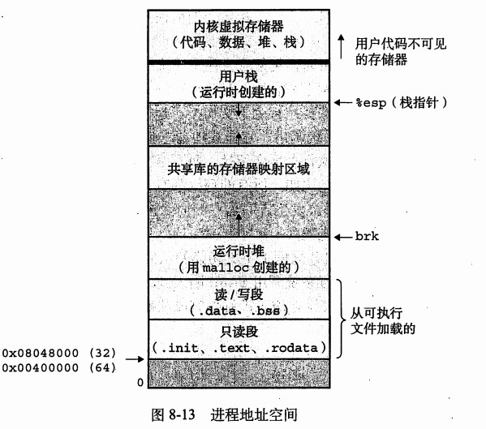

# C专家编程

[TOC]

## 第二章 C语言特性

### “多做之过”

- switch case语句的默认 fall through，极易引入问题；

- 字符串拼接功能在初始化字符串数组的时候容易引入问题：

  ```c
  char a*[] = {"first", "second" "third"};
  ```

  本意是定义3个元素的数组，但是实际上是2个元素。

- 默认定义为extern链接特性，针对全局程序可见

### “误做之过”

- 操作符的重载（在不同语境下代表不同的含义）
- 操作符的优先级和结合性
  
- 在所有不确定的地方都使用括号
  
- 库函数导致的安全问题：gets、scanf、etc

  > C99 有scanf_s

### “少做之过”

- 参数解析

- 注释

- 局部变量作为返回值

  > 可以使用静态变量解决这个问题，静态变量放在全局区。

- lint程序

  > c语言程序，都应该经过静态的和动态的检测程序的检测，并且保证新增代码也同样经过检测。
  >
  > 静态检测程序：pclint、cppcheck，cstyle check、etc
  >
  > 动态检测程序：vargrind、etc

## 第三章 C语言的声明

### 结构体、联合体、枚举

- 结构体可以直接赋值，相当于memcpy

  > - 可以用于简单的结构体赋值，而不适应memcpy
  > - ==可以进行函数传参==

- 联合体可以用于判断机子的大小端

  查看 [确定主机字节序](../主机字节序.md)

- 枚举可以用于调试器显示具体名字

### 声明的分析

见 https://www.nowcoder.com/questionTerminal/0f9c171f0d864d249e59cadcec3af36e?toCommentId=168712

cdecl实用程序

## 第四章 数组和指针

请分析下列程序的问题

```c
array.c
long long p[10] = {1,2,3,4,5,6,7,8,9,10};

main.c
#include <stdio.h>
//long long p[10] = {1,2,3,4,5,6,7,8,9,10};
extern long long *p;
int main()
{
    for (size_t i = 0; i < 10; i++) {
       printf("%d, ", p[i]);
    }
    return 0;
}
```

运行结果为：

```shell
huangyang@DESKTOP-4ORHO77:~/code/c$ ./a.out 
Segmentation fault (core dumped)
```

见 ./code/

### 分析如下

1. int p[10];定义了一个10个元素的数组
2. extern int *p声明p为指向int类型的指针
3. 当访问p[i]的时候，是访问p这个指针的内容+i个int偏移的位置的值。也就是
   - p的地址和数组的地址是一样的，也就是p这个指针的内容就是数组p的第一个元素，也就是1
   - 取i个偏移，假设为0个int偏移，也就是去 1+0 这个地址的内容，这个地址是不可访问的，所以出现段错误。

gdb调试如下

```shell
Program received signal SIGSEGV, Segmentation fault.
0x000000000800066e in main () at main.c:9
9              printf("%d, ", p[i]);
(gdb) p p
$1 = (long long *) 0x1
(gdb) 
```

从gdb的调试结构可以看出分析的正确性。

```注意：因为是使用64位操作系统，为了方便展示，数组定义为long long类型的数组。```

### 地址加偏移

```c
char *p = "sjsjjs";
char a[] = "sjhsjjk";

p[3]
a[3]
```

如上所述，2种不同的定义方式，和2种相同的取值方式。

p[3] = *(p + sizeof(\*p))

a[3] = *(a+sizeof(a[0]))

上述表达式看起来是一样的，但是实际处理的时候是不一样的。

- 第一个的p代表的是p这变量的内容
- 第二个a代表的是a这个变量的地址

所以第一种方式，还比第二种方式多一步，需要多取变量的内容。

## 第五章 对链接的思考

-- 编译和链接

### 编译过程

编译过程分为：

- 预处理

  - 目的：将程序的include，宏等执行替换。
  - gcc -E test.c -o test.i

- 编译

  - 目的：将预处理后的程序编译为汇编程序
  - gcc -S test.i -o test.s

- 汇编

  - 目的：将汇编程序转换为二进制目标文件
  - gcc -c test.s -o test.o

- 链接

  - 目的：将目标文件和库链接为可执行程序
  - gcc test.o -o test

  ```mermaid
  graph LR
  源码 -->|gcc -E| 预处理后程序
  预处理后程序 -->|gcc -S| 汇编代码
  汇编代码 -->|gcc -o| 目标文件
  目标文件 -->|gcc -l库| 可执行程序
  ```

  

### 静态链接和动态链接

  #### 概念

静态链接：如果函数库是可执行文件的一部分，那么就是静态链接。

动态链接：如果可执行文件只是包含了函数库的名字，让载入器在运行的时候寻找并加载需要的函数库，那么就是动态链接。

动态链接相比静态链接的特点：

- 可执行文件更小，编译过程更快；
- 性能上，虽然动态链接比静态链接的启动速度稍微慢点，但是多个动态链接的程序可以共享一个函数库，节省运行时消耗，操作系统也可以做更多的优化，这样性能可能更好；
- 动态链接的函数库变更和升级不需要重新链接，提高了灵活性；

#### 动态库创建和使用

https://www.cprogramming.com/tutorial/shared-libraries-linux-gcc.html

```makefile
makefile:
so:
	gcc -c -fpic -o add.o add.c
	gcc -shared -o libadd.so add.o
main: main.c
	gcc -o main main.c -L./ -I./inc -Wl,-rpath=./ -ladd -Wl,-M=main.map
clean:
	rm lib* main
```

- 使用-fpic产生位置无关的lib
- 使用 -shared选项将.o文件生成共享库
- -L选项告诉gcc，共享库需要在增加这个位置进行查找
- -I选项告诉gcc，源代码的头文件需要增加这个位置进行查找
- -Wl,-rpath=./ 其中-Wl告诉gcc要将后面的参数传入链接器，后面的-rpath告诉链接器程序的工作目录包括什么，在对应目录下找到动态库
- **-M=main.map选项让链接器生成map文件**

见：Notebook\language\c-c++\code\compile_link


#### 链接时候的命令行顺序

如上一节所述，如果将：

```
gcc -o main main.c -L./ -I./inc -Wl,-rpath=./ -ladd
```

改为：

```
gcc -o -ladd main main.c -L./ -I./inc -Wl,-rpath=./ 
```

就会出现下列错误：

```
huangyang@DESKTOP-4ORHO77:~/code/compile_link$ make main
gcc -o main -ladd main.c -L./ -I./inc -Wl,-rpath=./ 
/tmp/ccvoD9sN.o: In function `main':
main.c:(.text+0x21): undefined reference to `add'
collect2: error: ld returned 1 exit status
makefile:5: recipe for target 'main' failed
make: *** [main] Error 1
```

这是因为参数解析是从前往后解析的。


另外一个例子：(来自书上 100页)

```makefile
cc -lm main.c
```

出现有符号未找到的情况，这是因为静态链接库 libm.a，先是在main.c中查找需要链接的符号，再在libm中查找。


##### 综上所述

-l 总是放在命令的最右边

#### ldd查看程序依赖的动态库

```
huangyang@DESKTOP-4ORHO77:~/code/compile_link$ ldd ./main
linux-vdso.so.1 (0x00007fffd5115000)
libadd.so => ./libadd.so (0x00007f889a870000)
libc.so.6 => /lib/x86_64-linux-gnu/libc.so.6 (0x00007f889a470000)
/lib64/ld-linux-x86-64.so.2 (0x00007f889ae00000)
```

## 第六章 运行时数据结构

### 可执行文件的段布局

https://en.wikipedia.org/wiki/Data_segment

- Text

  可执行文件的指令。

- DATA

  已初始化的全局和静态变量。

- BSS

  未初始化的全局和静态变量。

  > 由于BSS段只保存没有值得变量，所以事实上并不需要保存这些变量的映像。运行时所需要的BSS段的大小记录在目标文件中，但BSS段并不占用目标文件的任何空间。

### 可执行文件在内存中的空间布局



### 堆栈和过程活动记录

### setjmp longjmp

### C语言工具

https://linuxtools-rst.readthedocs.io/zh_CN/latest/index.html

## 第七章 对内存的思考

虚拟内存和存储的体系结构

参考操作系统相关书籍

## 第八章 再论数组
### 数组和指针可交换性的总结
1. a[i]这样的访问被编译器改写为 *(a+i)
注意，当a是数组还是指针的时候，上述具体翻译不一样，参见前文描述
2. 函数参数的时候，传递的始终是指针，也就是指向数组的指针。见下文中的程序
```C
char ga[] = “ashshhsh”;
Void my_array_func(char ca[10])
{
    打印ca的地址（结果：0xeffffa14）
    打印ca的元素0的地址（结果：0x20900）
}

void my_pointer_func(char *ca)
{
    打印ca的地址（结果：0xeffffa14）
    打印ca的元素0的地址（结果：0x20900）
}

 Int main()
{
    打印ga的地址（结果：0x20900）
    打印ga元素0的地址（结果：0x20900）
}
```
可以看到，传入函数后，再函数内部分配了一个指针变量，存储数组的地址。
3. 其他所有场景，数组是数组，指针是指针。
### C语言的多维数组
C语言的多维数组其实就是数组的数组。
### 分析数组的声明
比如 char a[10][20]
可以按照分析声明的方法进行分析：
- 该变量a是一个数组
- 该数组有10个元素
- 每个元素是一个int类型的数组
- 每个元素是一个int类型的个数为20个的数组
所以：
a是一个具有10个元素，且每个元素是20个元素的数组的数组。即a是一个10 * 20的多维数组。
### 数组的内存布局
按照最右边的下标先变化的方式进行布局。
比如数组 a[2][3]，该数组在内存的排列为：
A[0][0], a[0][1], a[0][2], a[1][0], a[1][1], a[1][2]
这样的排列规律也可以体现在程序中，特别是针对大型数组的引用。
### 数组的初始化
Int a[][3] = { {0,0,0}, {1,2,3}}

## 第九章 再论指针

###  二维数组的内存表示

Int pea[4][6]

在内存中的表示是线性存储。获取某个值的方式是：

```c

pea是一个指向数组类型的具有4个元素的数组。

Pea[1][2] = *(*(pea + 1)+2)

Pea + 1 指pea这个指向数组的指针偏移到 1*sizeof（int pea[6])位置上；

其内容就是一个数组，重复上诉步骤。

```

