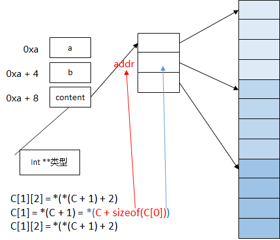
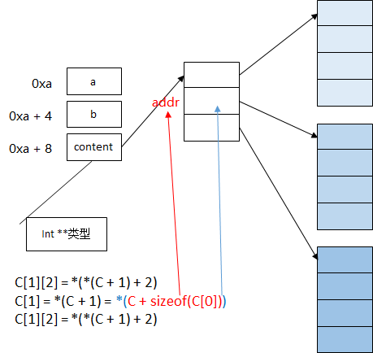

# 数组和指针

## 二维数组内存分配方法

### 连续内存空间

```c

typedef struct
{
    int a;
    int b;
} ArrayType;

typedef struct
{
    int maxX;
    int maxY;
    ArrayType **content;
} Array;

Array g_myA;

Array g_myA1;

void ArrayInit(int sizeX, int sizeY)
{
    g_myA.maxX = sizeX;
    g_myA.maxY = sizeY;

    g_myA.content = (ArrayType **)malloc(sizeof(ArrayType *) * sizeX);

    ArrayType *temp = (ArrayType *)malloc(sizeof(ArrayType) * sizeX * sizeY);
    if (temp == NULL)
    {
        return;
    }
    memset(temp, 0, sizeof(ArrayType) * sizeX * sizeY);

    for (size_t i = 0; i < sizeX; i++)
    {
        g_myA.content[i] = temp + i * sizeY;
    }
}
```



### 分配不连续空间

```c
void ArrayInit_1(int sizeX, int sizeY)
{
    g_myA1.maxX = sizeX;
    g_myA1.maxY = sizeY;

    g_myA1.content = (ArrayType **)malloc(sizeof(ArrayType *) * sizeX);

    for (size_t i = 0; i < sizeX; i++)
    {
        g_myA1.content[i] = (ArrayType *)malloc(sizeof(ArrayType) * sizeY);
    }
}
```



