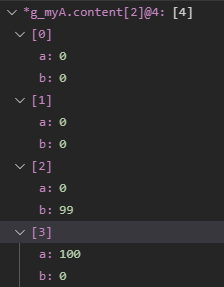
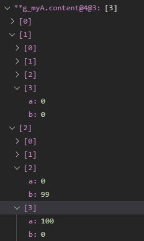

# GDB使用技巧

## 怎么使用GDB展开数组指针

下列是函数示例：

```c
#include <stdio.h>
#include <stdlib.h>
#include <string.h>

// typedef int ArrayType;

typedef struct
{
    int a;
    int b;
} ArrayType;

typedef struct
{
    int maxX;
    int maxY;
    ArrayType **content;
} Array;

Array g_myA;

Array g_myA1;

void ArrayInit(int sizeX, int sizeY)
{
    g_myA.maxX = sizeX;
    g_myA.maxY = sizeY;

    g_myA.content = (ArrayType **)malloc(sizeof(ArrayType *) * sizeX);

    ArrayType *temp = (ArrayType *)malloc(sizeof(ArrayType) * sizeX * sizeY);
    if (temp == NULL)
    {
        return;
    }
    memset(temp, 0, sizeof(ArrayType) * sizeX * sizeY);

    for (size_t i = 0; i < sizeX; i++)
    {
        g_myA.content[i] = temp + i * sizeY;
    }
}

void ArrayInit_1(int sizeX, int sizeY)
{
    g_myA1.maxX = sizeX;
    g_myA1.maxY = sizeY;

    g_myA1.content = (ArrayType **)malloc(sizeof(ArrayType *) * sizeX);

    for (size_t i = 0; i < sizeX; i++)
    {
        g_myA1.content[i] = (ArrayType *)malloc(sizeof(ArrayType) * sizeY);
    }
}


void Process()
{
    g_myA.content[2][3].a = 100;
    g_myA.content[2][2].b = 99;

    for (size_t i = 0; i < g_myA1.maxX; i++)
    {
        for (size_t j = 0; j < g_myA1.maxY; j++)
        {
            g_myA1.content[i][j].a = i + 2 * j;
        }
    }
}

void Output()
{
    printf("%d\n", g_myA.content[0][1].a);
    printf("%d\n", g_myA.content[2][3].a);
    printf("%d\n", g_myA.content[2][2].b);
}

void PrintA()
{
    for (size_t i = 0; i < g_myA.maxX; i++)
    {
        for (size_t j = 0; j < g_myA.maxY; j++)
        {
            printf("(%d, %d), ", g_myA.content[i][j].a, g_myA.content[i][j].b);
        }
        printf("\n");
    }
}


void PrintA_1()
{
    for (size_t i = 0; i < g_myA1.maxX; i++)
    {
        for (size_t j = 0; j < g_myA1.maxY; j++)
        {
            printf("(%d, %d), ", g_myA1.content[i][j].a, g_myA1.content[i][j].b);
        }
        printf("\n");
    }
}

int main()
{
    int a = 3;
    int b = 4;
    ArrayInit(a, b);
    ArrayInit_1(a, b);
    Process();
    Output();
    return 0;
}

```


### 一维数组

对于数组 ```int *a;a=(int*)malloc(10);```的一维数组指针来说，通过@n命令可以显示该数组的n个内容。

```shell
(gdb) p *g_myA.content[2]@4
$2 = \{\{a = 0, b = 0}, {a = 0, b = 0}, {a = 0, b = 99}, {a = 100, b = 0\}\}
```

上面的```g_myA.content[2]```是``` ArrayType*```类型的指针：

- 第一步，取指针的内容，即：```*g_myA.content[2]```
- 第二步，确认需要显示多少数组元素，即```*g_myA.content[2]@4```

vscode显示效果：



### 二维数组（内存连续分配， ArrayInit）

```shell
(gdb) p **g_myA.content@4@3
$3 = \{\{{a = 0, b = 0}, {a = 0, b = 0}, {a = 0, b = 0}, {a = 0, b = 0\}\}, \{\{a = 0, b = 0}, {a = 0, b = 0}, {a = 0, b = 0}, {a = 0, b = 0\}\}, \{\{a = 0, b = 0}, {a = 0, b = 0}, {a = 0, b = 99}, {a = 100, b = 0\}\}}

相当于：
p ((**g_myA.content)@4)@3
$3 = \{\{{a = 0, b = 0}, {a = 0, b = 0}, {a = 0, b = 0}, {a = 0, b = 0\}\}, \{\{a = 0, b = 0}, {a = 0, b = 0}, {a = 0, b = 0}, {a = 0, b = 0\}\}, \{\{a = 0, b = 0}, {a = 0, b = 0}, {a = 0, b = 99}, {a = 100, b = 0\}\}}
```

- 第一步，取指针的内容，即：```**g_myA.content```
- 第二步，确认需要显示多少数组元素，即```**g_myA.content@4@3```
  - 第二步可以理解为：取@4个```**g_myA.content```元素，然后再取@3组刚刚取的4个元素。

vscode显示效果：



### 二维数组（内存非连续分配， ArrayInit_1），@方法失效

```c
p ((**g_myA1.content)@4)@3
$4 = \{\{{a = 0, b = 0}, {a = 2, b = 0}, {a = 4, b = 0}, {a = 6, b = 0\}\}, \{\{a = 0, b = 0}, {a = 49, b = 0}, {a = 1, b = 0}, {a = 3, b = 0\}\}, \{\{a = 5, b = 0}, {a = 7, b = 0}, {a = 0, b = 0}, {a = 49, b = 0\}\}}
```

可以看到，只有前4个元素的显示是正确的，后面的元素都是非正确的。

这是因为gdb只是通过第一个元素地址根据@的指示进行取值显示。

### 通过打印函数显示（可以显示任意的变量）

gdb 可以通过call命令调用函数，这样就可以写自己的打印函数，然后在调试的时候打印。

```shell
(gdb) call PrintA_1
$1 = {void ()} 0x8000a3a <PrintA_1>
(gdb) call PrintA_1()
(0, 0), (2, 0), (4, 0), (6, 0), 
(1, 0), (3, 0), (5, 0), (7, 0),
(2, 0), (4, 0), (6, 0), (8, 0),
(gdb) call PrintA()
(0, 0), (0, 0), (0, 0), (0, 0), 
(0, 0), (0, 0), (0, 0), (0, 0),
(0, 0), (0, 0), (0, 99), (100, 0),
```

### 参考

http://bjbook.net/bk/gdb/Arrays.html

